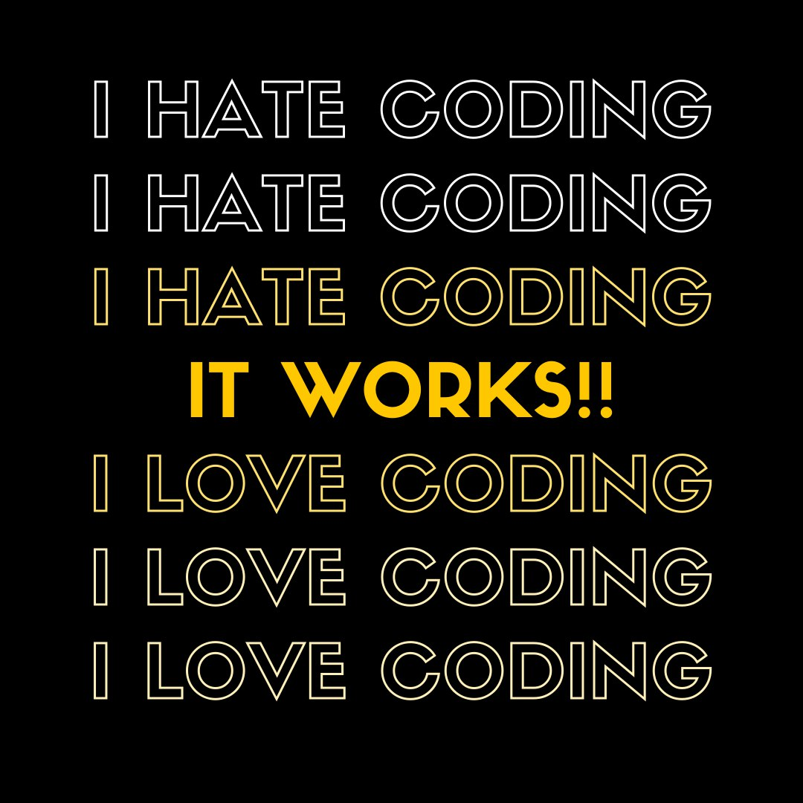
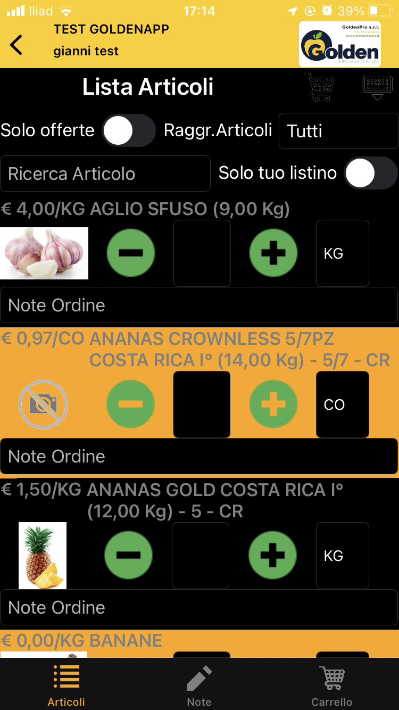
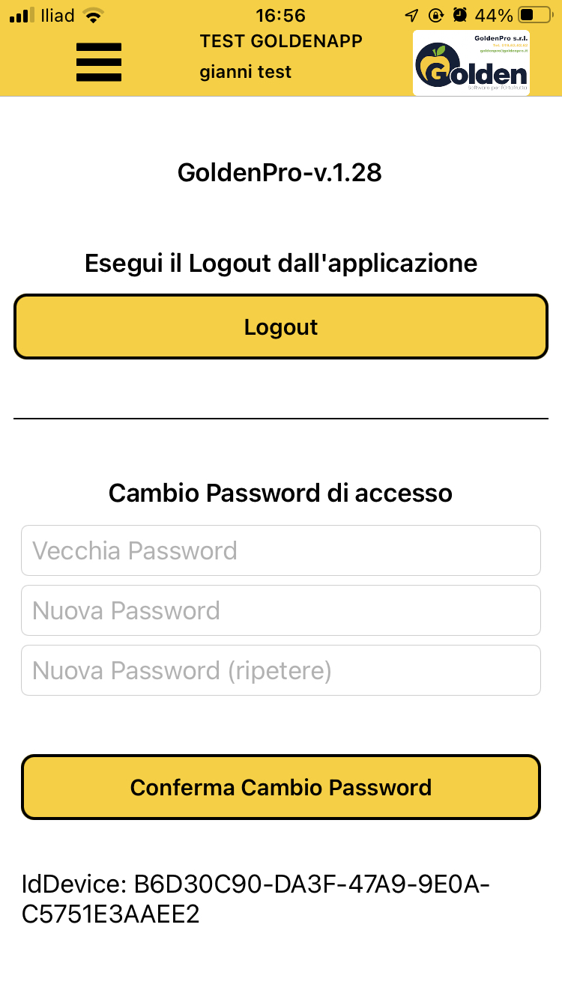
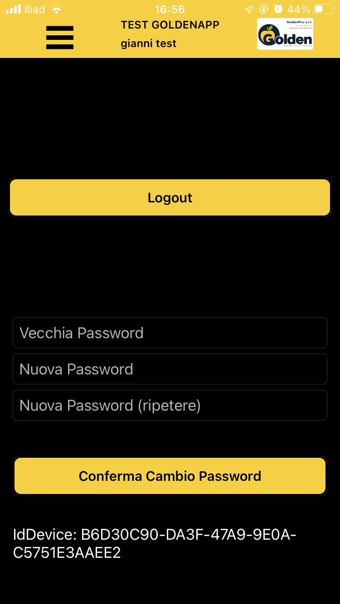
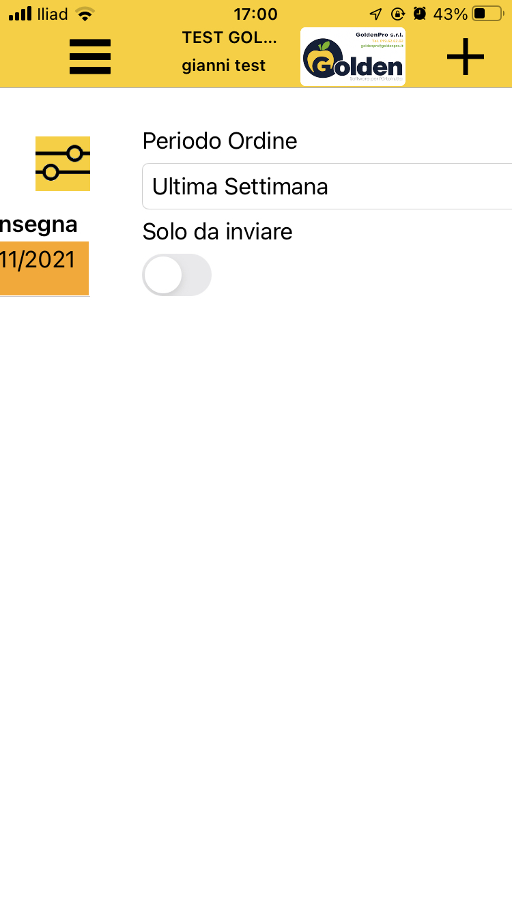
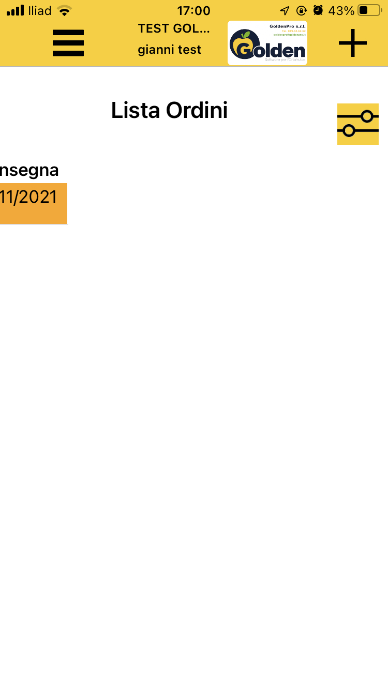
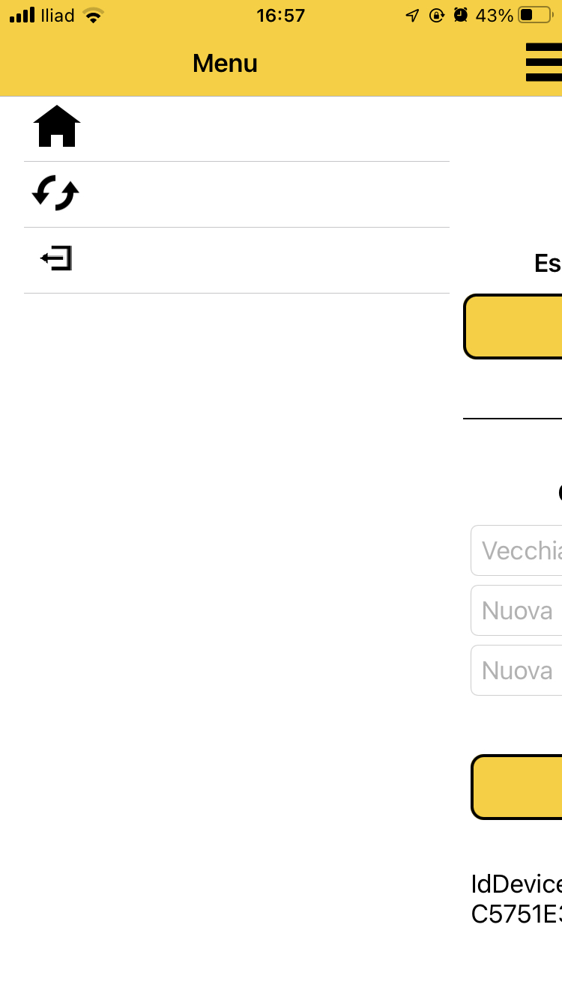
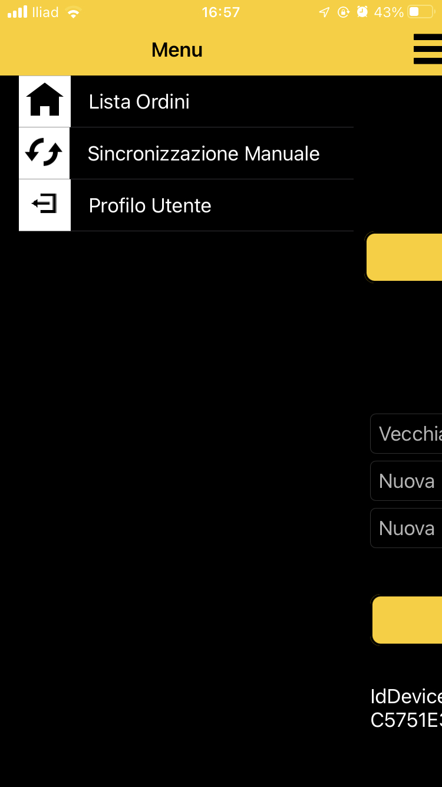

)

---
<!-- backgroundColor: #f7f7f7 -->

# Bottoni non visibili in dark mode
# Semantica dei controlli
# Ordine di navigazione

---

# Colore testi hardcoded bianco/nero
Alcuni testi non possono più essere letti

---

# Immagini che si comportano da bottoni
Che differenza c'è tra un bottone contenente un'immagine e un'immagine alla quale è stato assegnato un tap gesture recognizer? **Tantissimo!**

---

# Elementi della lista senza semantica 
I campi dell'intestazione vengono letti **solo una volta** dallo screen reader. Poi, per ogni elemento della lista, vengono letti solo i valori.

---

# Utilizza elementi di UI standard
- **L'accessibilità è gratis** ed è meno oneroso gestire le interazioni con l'utente (con meno bug)
    - In questo caso la view laterale quando è nascosta è comunque accessibile dallo screen reader
- L'app assume un aspetto più professionale

---

# Utilizza elementi di UI standard (2)
I problemi di accessibilità possono emergere anche senza attivare lo screen reader

